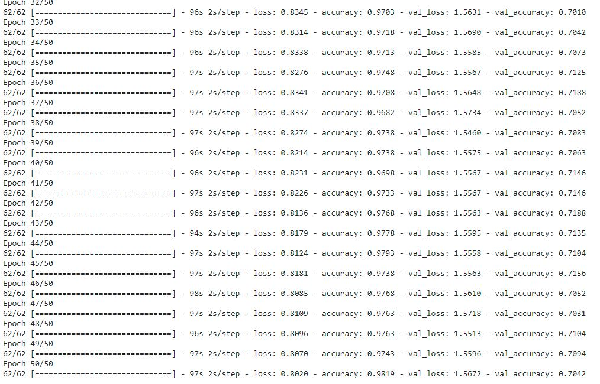
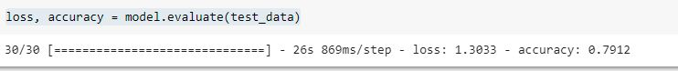
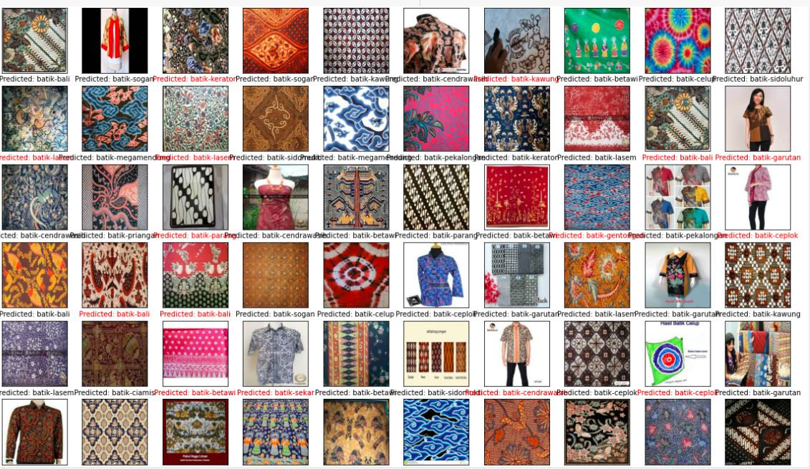
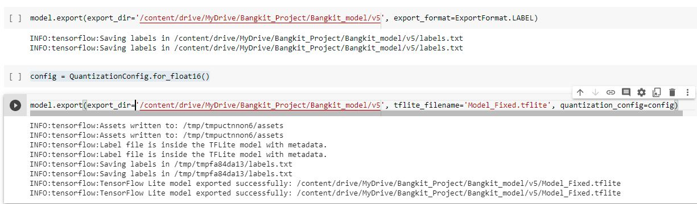

# BATIK CLASSIFICATION WITH MOBILNETS ARCHITECTURE

>In this project, I implemented a deep learning architecture Mobilenet to identification and classification batik to 20 classes
(batik-bali, batik-betawi, batik-celup, batik-cendrawasih, batik-ceplok, batik-ciamis, batik-garutan, batik-gentongan, batik-kawung, batik-keraton, batik-lasem, batik-megamendung, batik-parang, batik-pekalongan, batik-priangan, batik-sekar, batik-sidoluhur, batik-sidomukti, batik-sogan, batik-tambal)

>For doing this project we used the following resources: https://www.kaggle.com/dionisiusdh/indonesian-batik-motifs

## Model specifications and results
>The architecture of this project is based on _Mobilnet_.

>**we use a pre-trained model** Because the pre-trained models have their parameters more adjusted and the filters they have learned are more polished, in consequence, we can avoid the process of teaching the network those filters and the only thing that we should focus on is to adjust the other parameters to the specifications of our data set.

#How to use

### you need to instal : 
!pip install tflite-model-maker 
(for get all requirment) and you'll get:
- keras-preprocessing=1.1.2
- tensorboard=2.5
- numpy==1.16.1
- opencv-python==4.0.0.21
- scikit-learn=0.19.0
- python=3.7

### Download dataset and split it to be 3 folder
- data_training
- data_testing
- validation

### Augumented Data
-
-
-

### Training prosess

### Evaluate Model

### Results
* **PREDICT LABEL**

### the last is save your model

